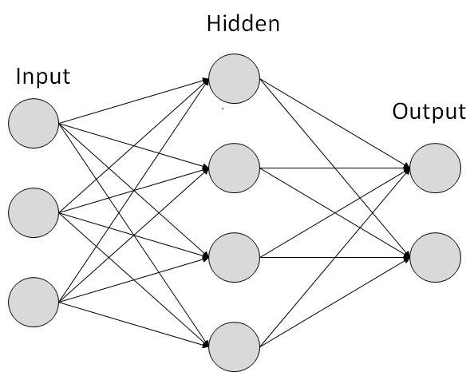
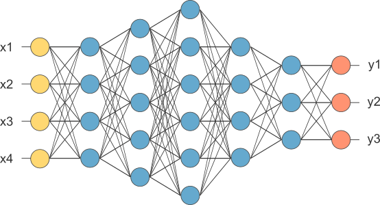

# Neural networks and deep learning

This is a set of courses to understand and learn how to create deep learning models and tune them, to be able to create and deploy AI solutions for web and software development from deep learning AI in coursera.
* Neural networks and deep learning
* Improving deep neural networks: hyperparameter tuning, regularization and optimization
* Structuring machine learning projects
* Convolutional neural networks
* Natural language processiong: building sequence models

For some tips on using Markdown check out these online resources:
* [Using Markdown on Replit](https://docs.replit.com/tutorials/markdown)
* Markdown Guide's [cheat sheet](https://www.markdownguide.org/cheat-sheet/)
* Markdown Guide's [Basic Syntax Overview](https://www.markdownguide.org/basic-syntax/)
  
# What is a (Neural Network) NN?

Single neuron == linear regression without applying activation(perceptron)

Basically a single neuron will calculate weighted sum of input(W.T*X) and then we can set a threshold to predict output in a perceptron. If weighted sum of input cross the threshold, perceptron fires and if not then perceptron doesn't predict.

Perceptron can take real values input or boolean values.

Actually, when w⋅x+b=0 the perceptron outputs 0.

Disadvantage of perceptron is that it only output binary values and if we try to give small change in weight and bais then perceptron can flip the output. We need some system which can modify the output slightly according to small change in weight and bias. Here comes sigmoid function in picture.

If we change perceptron with a sigmoid function, then we can make slight change in output.

e.g. output in perceptron = 0, you slightly changed weight and bias, output becomes = 1 but actual output is 0.7. In case of sigmoid, output1 = 0, slight change in weight and bias, output = 0.7.

If we apply sigmoid activation function then Single neuron will act as Logistic Regression.

we can understand difference between perceptron and sigmoid function by looking at sigmoid function graph.

Simple NN graph:

RELU stands for rectified linear unit is the most popular activation function right now that makes deep NNs train faster now.

Hidden layers predicts connection between inputs automatically, thats what deep learning is good at.

Deep NN consists of more hidden layers (Deeper layers)

