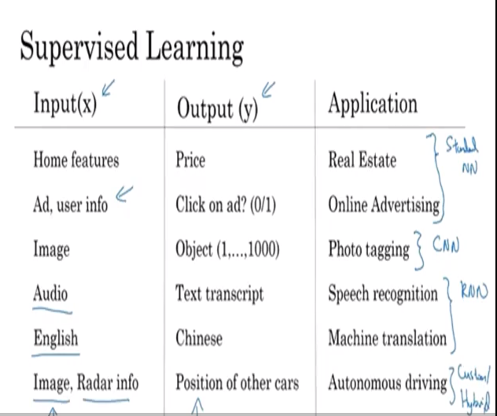
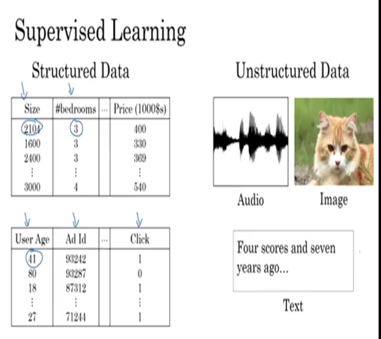

# 03 supervised learning

one of the most lucrative implementations of neural networks had been the supervisde learning models (YO have a set of data with inputs, and then you get an output)

for example:
- ad with user info, then you get as a result the ads the user clicks on, so the model shows you the ads you are more likely to click.

# structured and unstructured data

some models might want to recognize objects that have no order, like audio or image.

