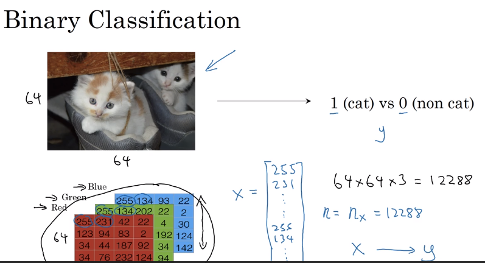
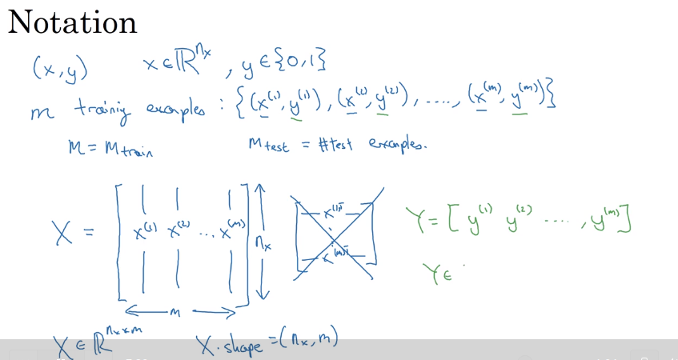
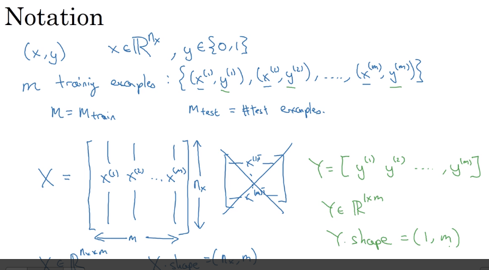

# 07 binary classification

- feature vector are usually included to create binary classification algorithms

- x e Rnx
some notatino on binary classifications

- stacking the vectors as rows instead of columns, makes the implementation of the code very difficult, so it is better to stack the examples as columns.

