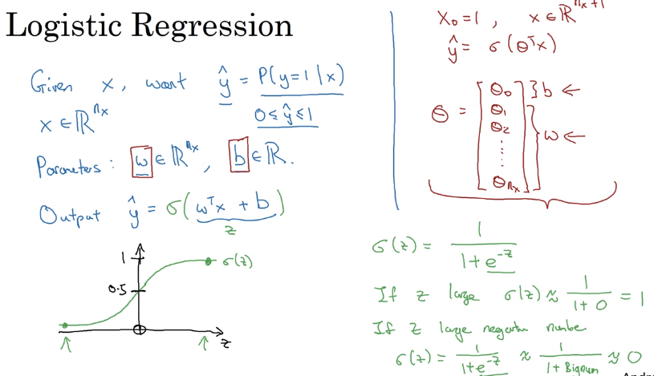

# 08 logistic regression

- these are used to create an algorithm for binary classification:

the probability that a determined set of data corresponds to an expected value: e.g.

the probability that a set of images contains cats.

- it makes sense to separate the trivial case 'b' from the transposed matrix, so in some other courses you might see that b is equal to the first case of the data matrix, here, that is not the case:

