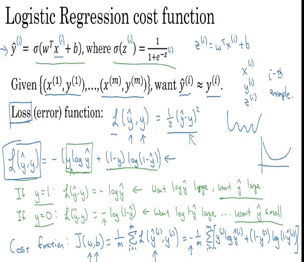

# 09 logistic regression cost function

## loss (error) function

- we need to measure how good our model is compared to the real value of the data.
- here are some justifications for a logarithmic loss function for the logistic regression models
  

### loss function

- this one is applied to a single example of the dataset

### cost function

- is the cost function used to evaluate the parameters set for the functions