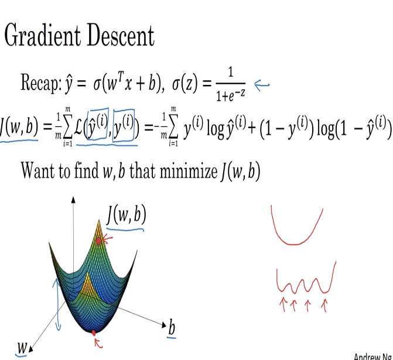
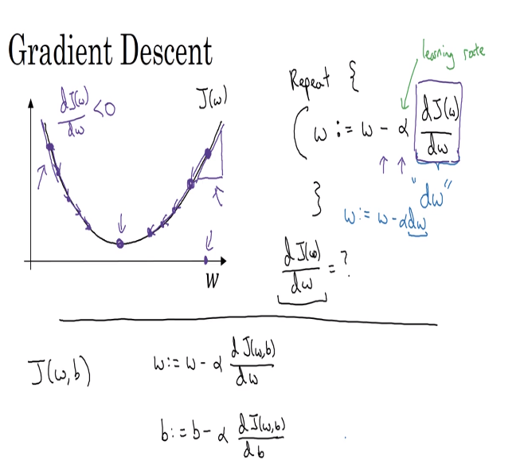

# 10 gradient descent

- for the loss function and the cost function, a convex surface named J(w, b) was chosen to be the regression function because it has a single optimal point in the surface (different to polynomic functions or other regression functions).
- the shape of the surface always ends in a single optimal point, that is why the logarithmic function is chosen for the optimization.

## learning rate

- for us to be able to make the curve converge to the lower point, we update the values w by substracting alpha values (learning rate) times the derivative of the function J(w) in terms of w.

