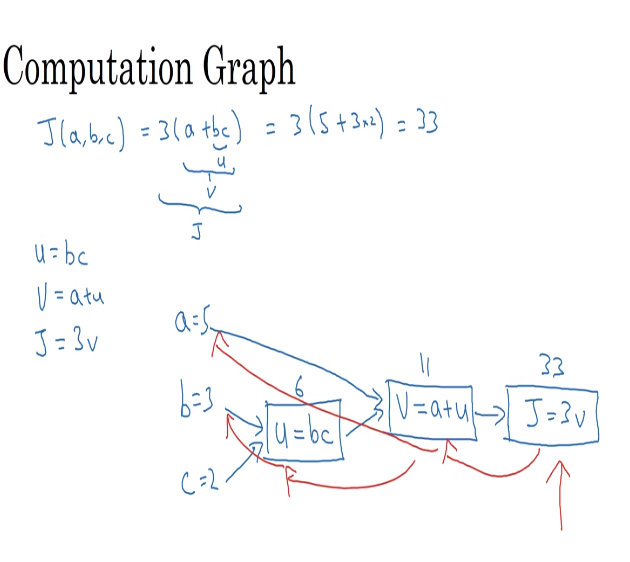

# 13 computation graph

- we need to create graphs to understand how to run processes from a start point to an expected value
- these algorithms are the way to understand how processes are run to achieve an algorithm goal

