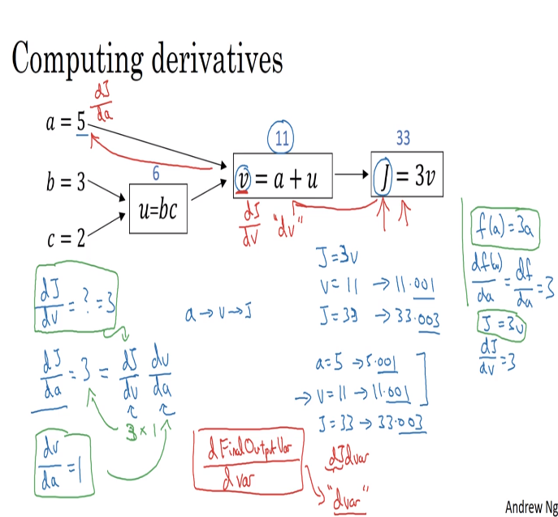
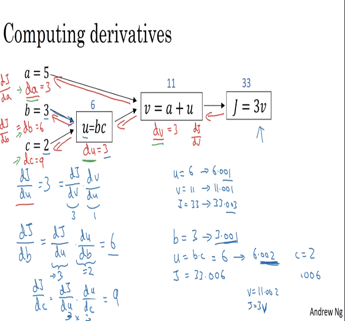

# 14 backwards propagation

- to be able to plot our models in python, we need to check over the derivatives of our model to see how a variable change affects the output.
- the convention of 'dvar' is related to the value of the rate of change of the variable that comes from the final output variable.
- we also use the chain rule to calculate the derivatives of function J.

## approximation by trial (derivatives by computational graph)

- we increase a little one of the variables and calculate the slopes (derivatives) by following the direction of the arrows

