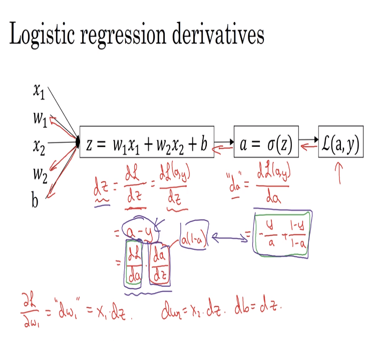
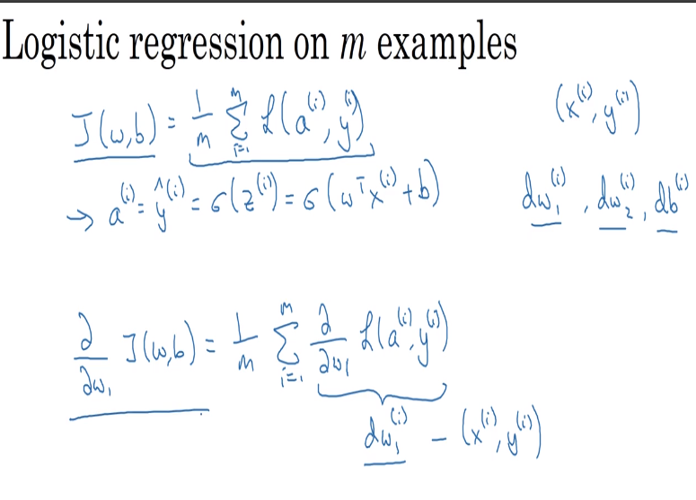
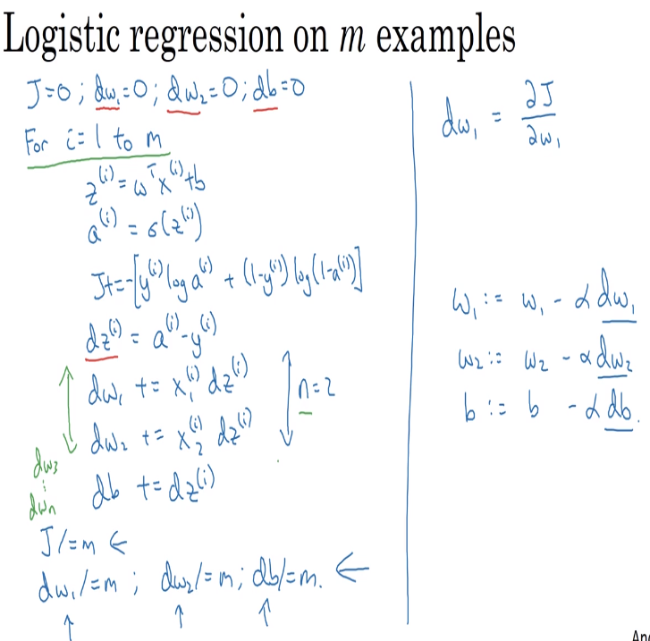

# 15 logistic regression gradient descent

- we want to calculate the derivatives of the loss function to be able to implement de logistic regression for our models as follows
  

## logistic regression on m examples

- to get the values of the predicion ^Y for a certain example on the logistic regression J(w, b) we use the summatory of the values of the loss function according to the following expressions.
- we have previously defined the sigma function (W matrix transposed product with a X(i) sample data plus b constant)
- we have also determined the partial derivatives of J function and how to find the partial derivatives regarding W(i)

 

 ## logistic regression for a sample with overall loss function = 0

 

 ## we get rid of for loops using vectorization (that is what changed the implementation of logistic regressions)