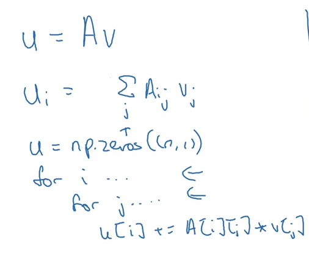
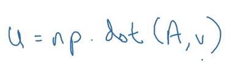
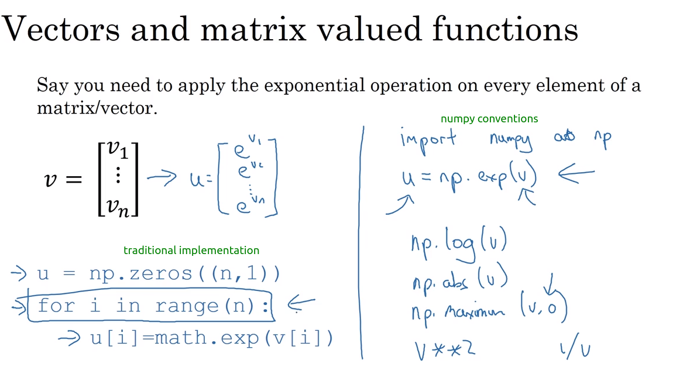

# 17 vectorization

- vectorization is a technique that allows to create math implementations in code so that the running times are lowered

# difference between vectorized vs non-vectorized implementations

- vectorized algorithms can speed up to 100% the calculations for the regressions
  

## avoid using for loops whenever possible

- this would be a for-loop implementation for a matrix product (arrays product)

- while the following would be an example of the implementation in numpys of dot product between two dimensional arrays

this last one is 100% faster than the for loop

## look forward to use python (numpy) conventions over traditional algorithms

- 