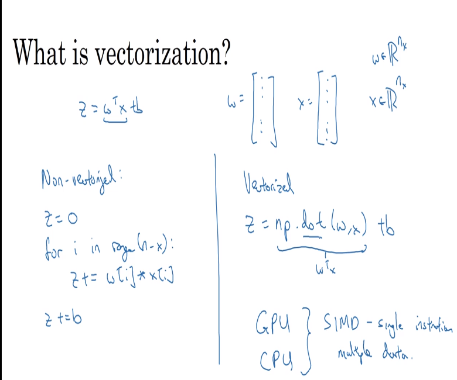

# 17 vectorization

- vectorization is a technique that allows to create math implementations in code so that the running times are lowered

# difference between vectorized vs non-vectorized implementations

- vectorized algorithms can speed up to 100% the calculations for the regressions
  

