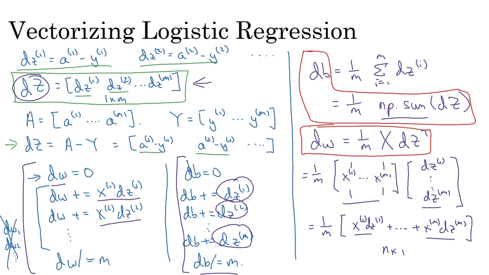

# 20 gradient output

- the following is the setup of the gradient iuput for the logistic regresison

- then, check the implementation in numpys for the vectorization to eliminate the `for` loops in the gradient output

