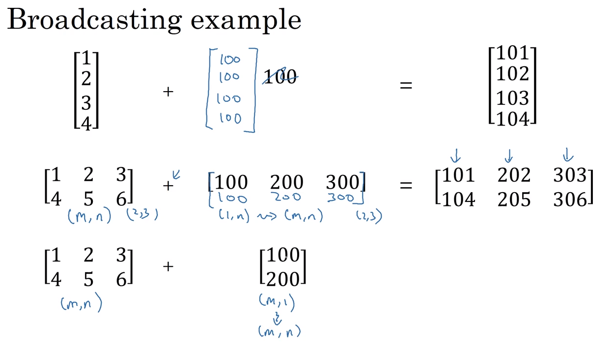
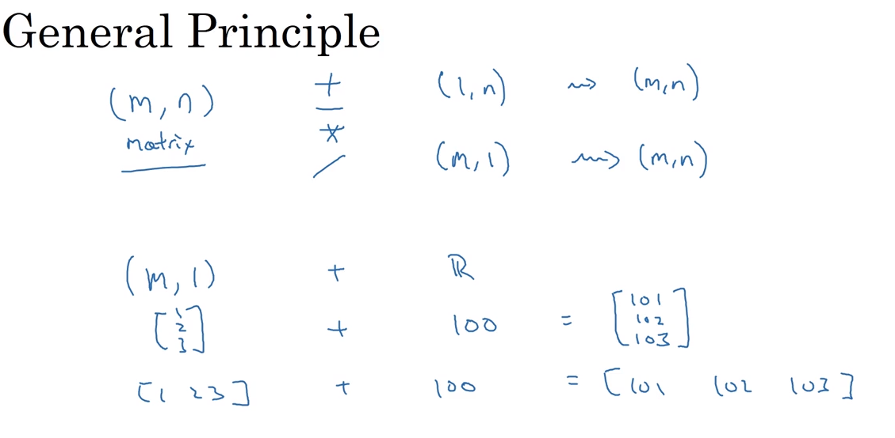

# 21 broadcasting in python (efficient computation)

- lets say we hav a matrix of calories in food, and we want to calculate percent of calories per row (protein, carbs and fat)
- we should have to use a for-loop to calculate the carbs/total calories

- check the implementation in the python repo (21-broadcasting)

## rules of matrix sum and dot product

## broadcasting rules

