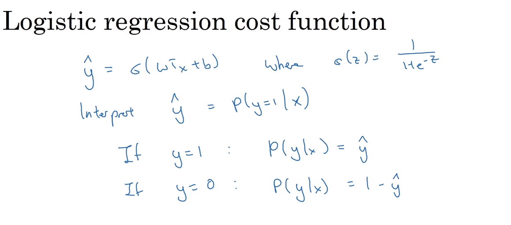
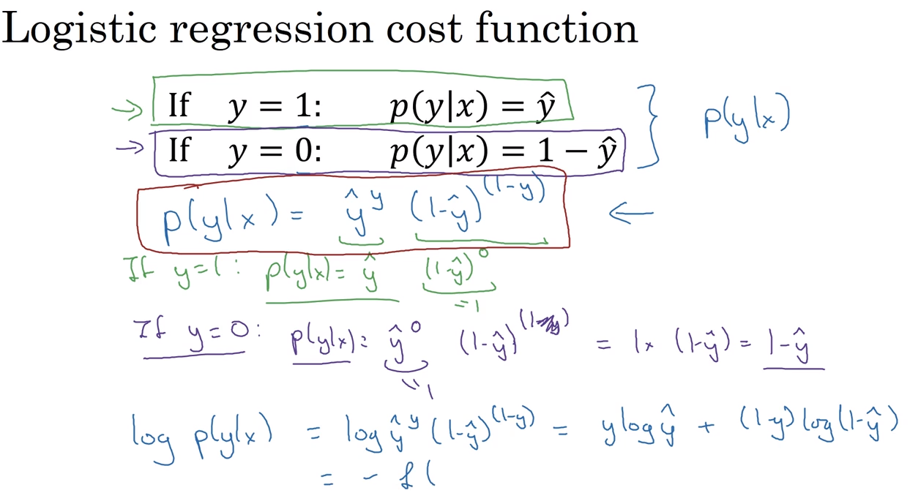
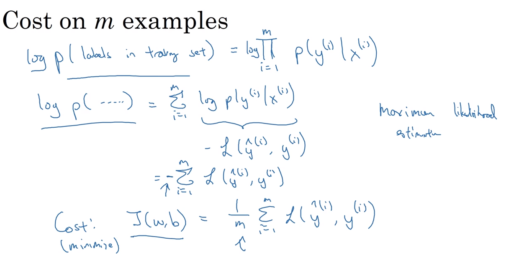

# 24 cost function

- we want to find the prediction y^ as the probability of y being one, according to the value of a sample x
- we write y^ as the sigmoid function G(z) as 1/1+e^-z

- to find a logistic regression equation, we search the logarithm of the estimation y^

## cost function on m examples

- we minimize the logarithmic expression of the loss function L, by eliminating the minus value:

