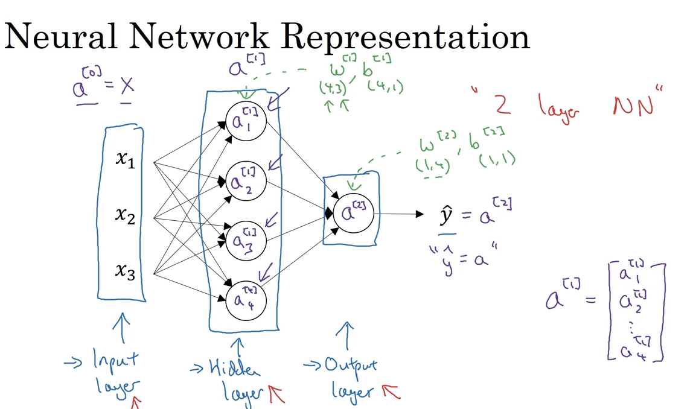

# 27 neural network representation

## naming conventions

in a traditional neural network representation we usually have a set of elements that compose the network, namely, input layer, hidden layer and output layer

## activations

- the activations are an alternative name for the vectors in each of the stages and we denote them by `a`

a^[0] = X => activations of input layer
a^[1] = X => activations of hidden layer
y^ = a^[2] = X => activations of output layer (or as well, y^ = a)

- the input layer is usually not accounted for the amount of layers, so this would be a 2 layer NN (neural network)

