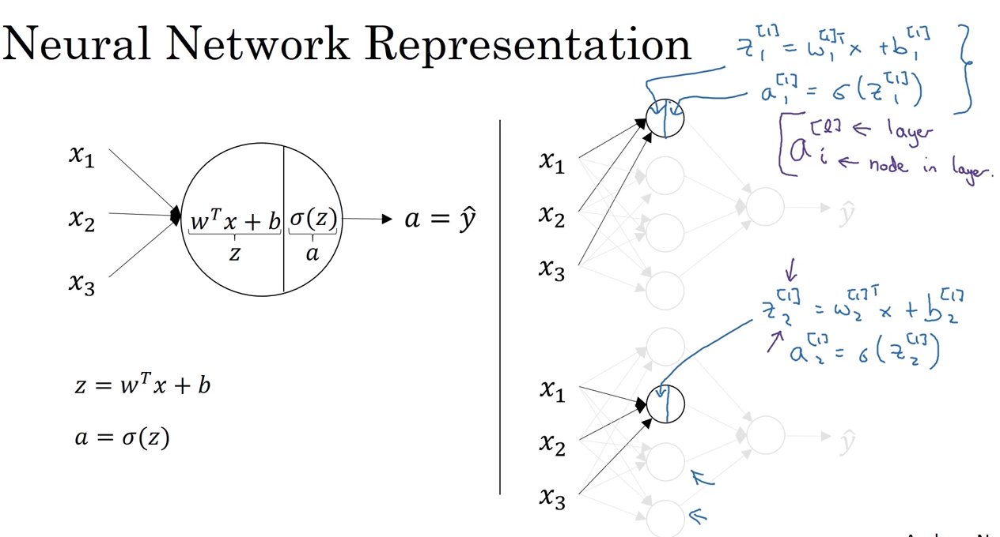
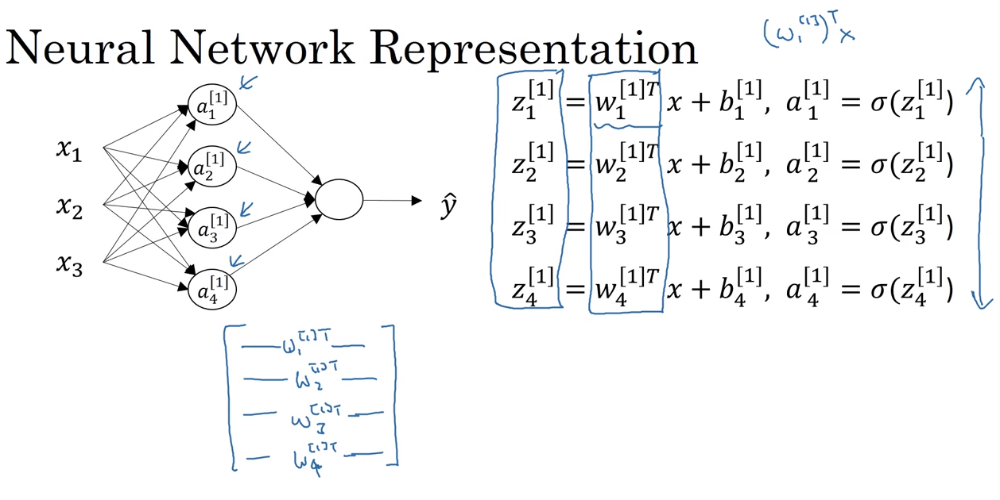
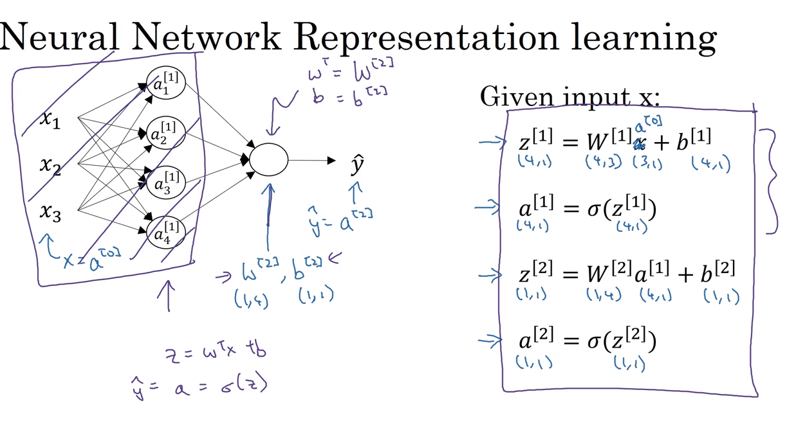

# 28 computing a neural network

## logistic regression is a single step between input layer and hidden layers

- the logistic regression repeats itself for each of the nodes in the hidden layer, that is basically what happens in a neural network

### set of equations for the hidden layer nodes

- another way of representing the network so that we can compute it efficiently is by vectorizing the values of z, w, b and a, as follows:

- here is the demonstration fo how with 4 lines of code we can compute a 4 hidden layer nodes neural network predictions:

