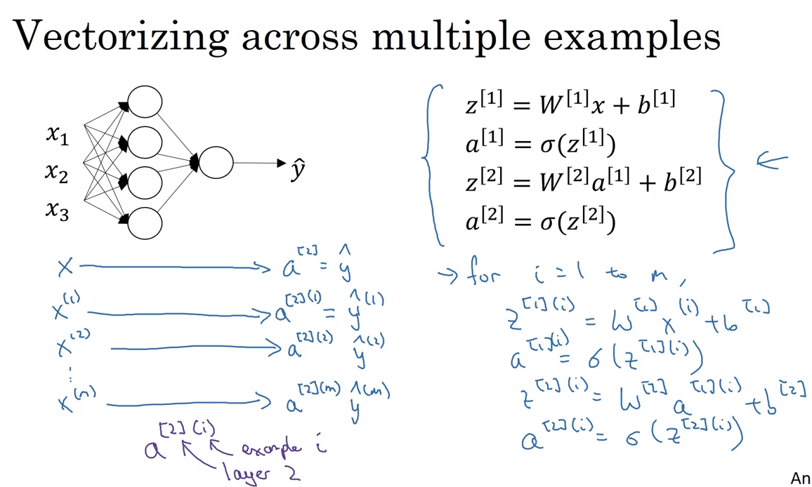
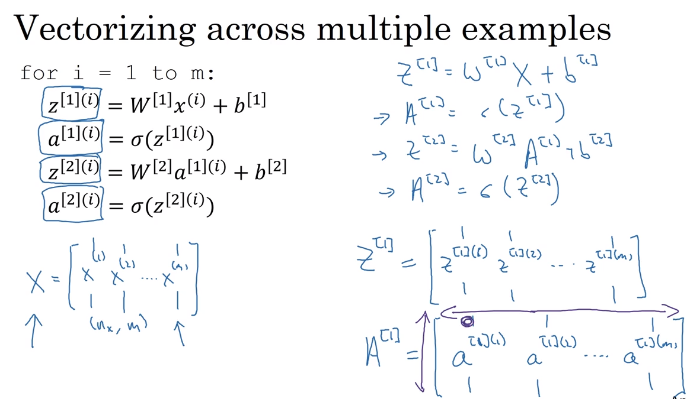
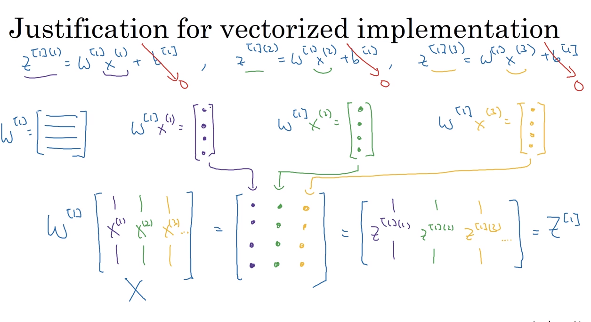

# 29 vectorizing multiple examples

- we would have to iterate over every example to obtain our predicion y^
- we could vectorize the `for` loops so that we do a matrix operation instead of an algorithmic one

## vectorization

- we should stack our vectors horizontally so we can compute over them

### vertical values of activations matrix A

- the vertical values in the activation matrix are the activation values of hidden units

### horizontal values of activation matrix A

- the horizontal values correspond to the values for the training examples

# 30 justification for vectorized implementation

