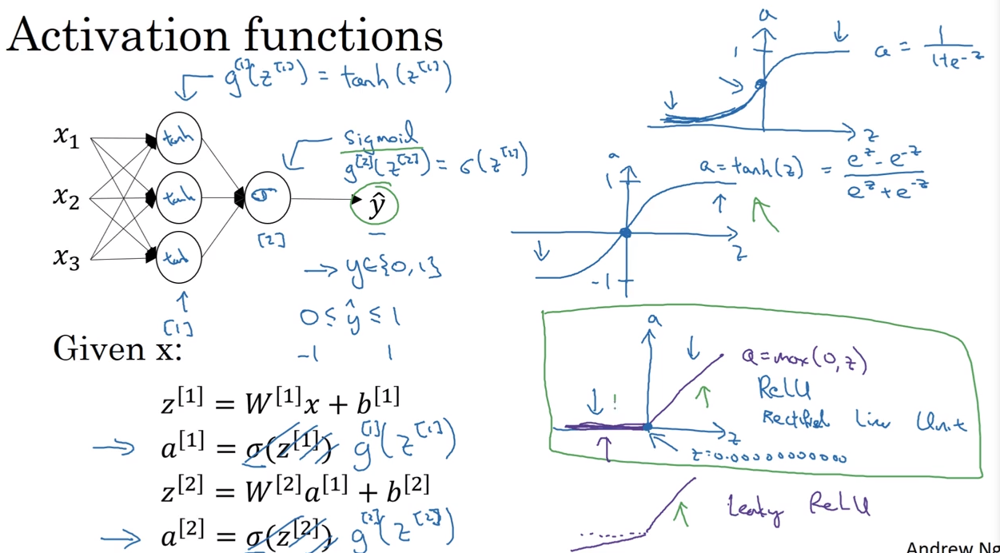

# 31 activation functions

- when creatin neural networks we have the chance of selecting the activation functions to find out
- instead of using the sigmoid function G, we can choose other functions such as hyperbolic tangent
- the sigmoid activation function is only preferred in the output layer, because the values can be `0 <= y <= 1`, instead of `-1 <= y <= 1`

## hyperbolic tangent function

- tanh function is strictly superior at finding relations in the hidden layers

## ReLU (rectified linear unit) function

## leaky ReLU 

- here, the derivative when z = 0 exists and has a stepper slope than ReLU

## sigmoid function

