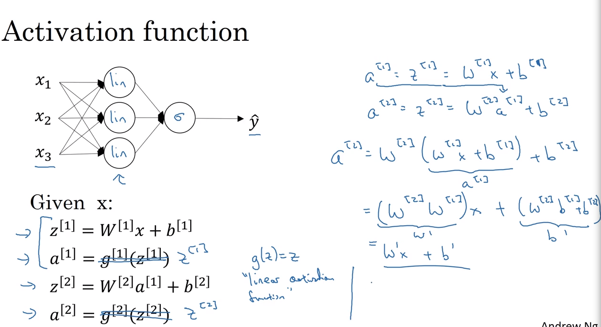

# 32 non linear activation functions

- when creating a neural network with hidden layers we have an algorithm structure like the following

x1 linear
x2 linear sigmoid y^
x3 linear

if we have a structure like this, having linear functions makes no sense, the result would be the same as if we have a simple logistic regression because the composition of linear functions with linear functions gives a linear function as a result, so there will be no real life approximation through linear functions in the hidden layers

