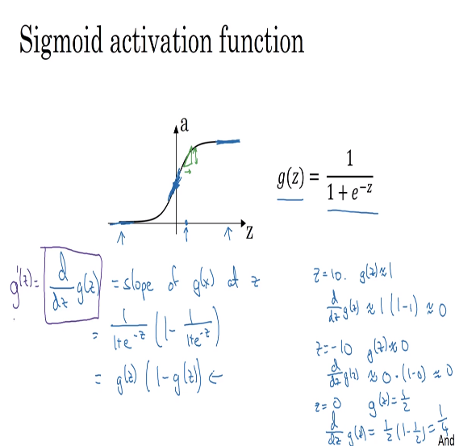
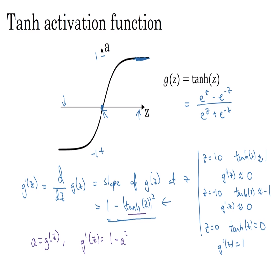
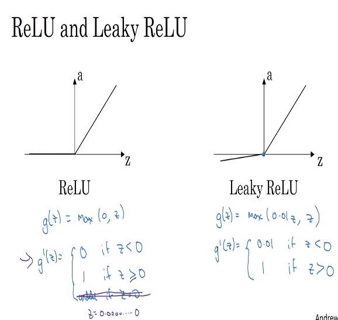

# 33 derivatives of activation functions

- here we check the exact expressions for the activations functions and their corresponding derivatives (to find the slopes)

## sigmoid activation function

## hyperbolic tangent function

## ReLU and leaky ReLU

