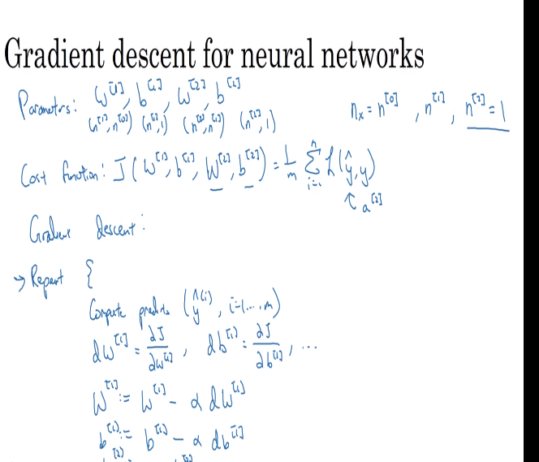
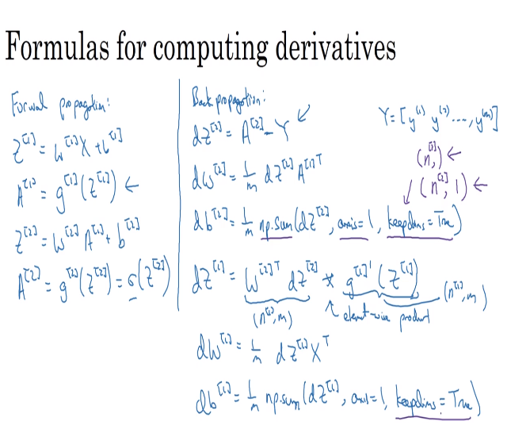

# 34 gradient descent for neural networks

- here we have the expressions to implement the gradient descent for neural networks
- these are the ones we need to implement to be able to create a model and train it
- it is important to initialize the parameters randomly

