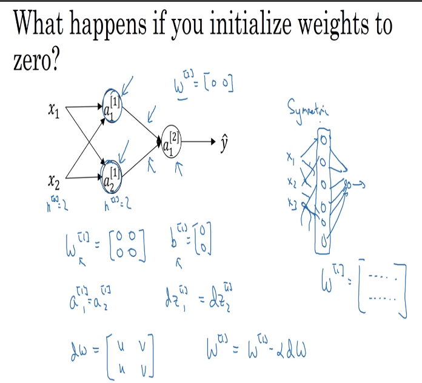
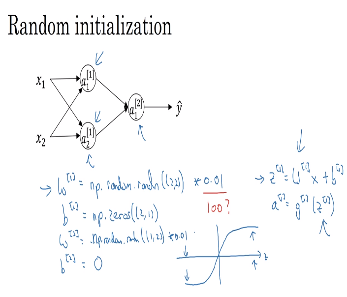

# 36 random initialization

- it makes no sense for us to initialize our weights to zero. This is due to the fact that setting a matrix W = [{0, 0}, {0 ,0}] would make the activation values compute the same equations (therefore all the activations would be the same) and that makes no sense whatsoever.

- we should also initialize the values near zero anyway, because if they are very big values ( > 100 ) then the model won't be able to train itself successfully

