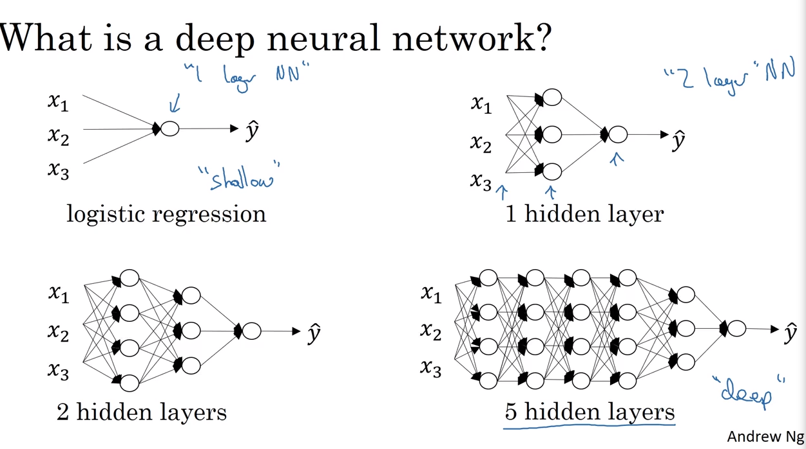
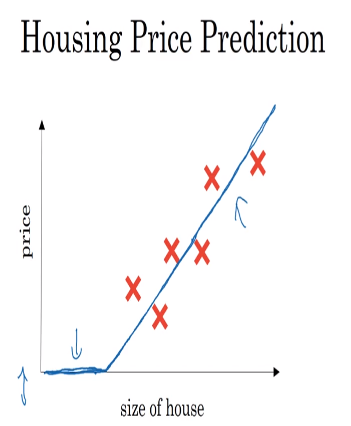

# 38 deep neural networks

- below we can check on different types of neral networks with different kinds of depth associated to the hidden layers
- we call the logistic regressions "shallow neural networks"
- we also call networks with several hidden layers "deep neural networks"

## notation for neural networks

