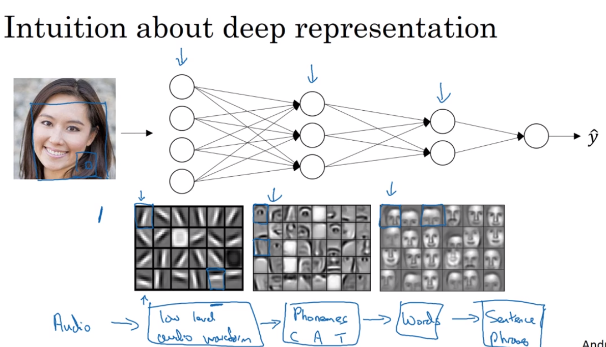

# 41 deep representation

- why does deep representation is working so well with problems of the real life
- first step an equation would find edges of a face
- second step would find round things, such as eyes
- then the last layer would put the two together and build a partial face (at least as shadows)
- the set of different steps is capable of going from simple representations of things, and then converge to build very complex structures and results
  
