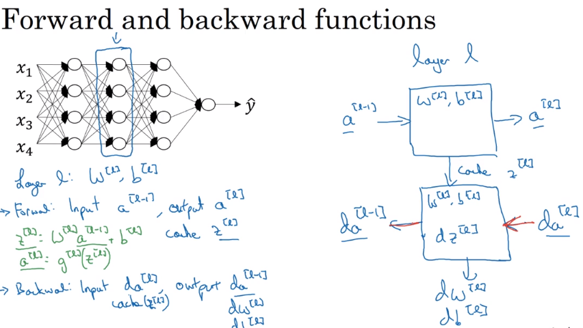
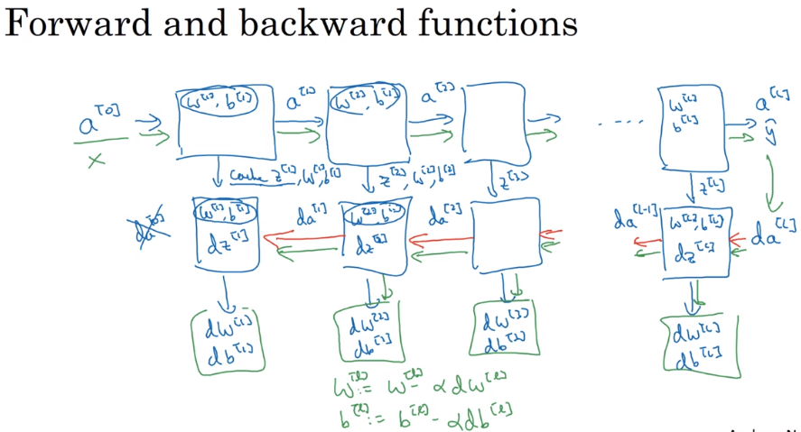

# 42 blocks of deep neural networks

- currently we should be able to set a group of methods to be used in forward and backward propagation in deep neural networks.
- Below we have an abstract of the computations we need to be able to create a deep neural network

- we cache the values of the activations Z function which is used to compute the backward propagations to obtain the constants B vector and the weights vectors

