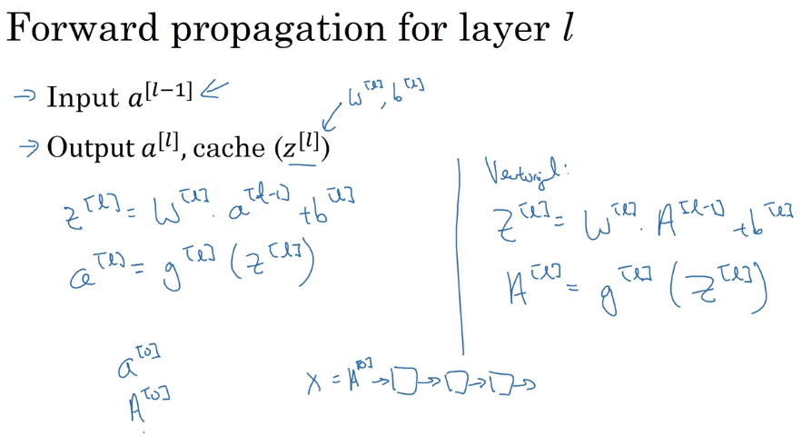
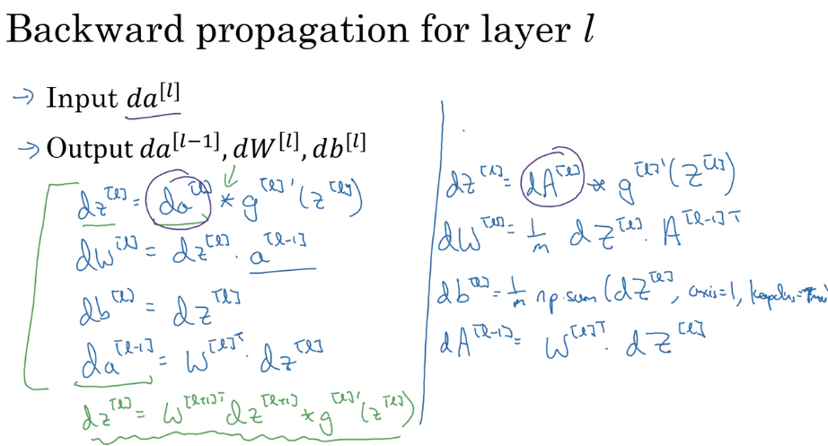
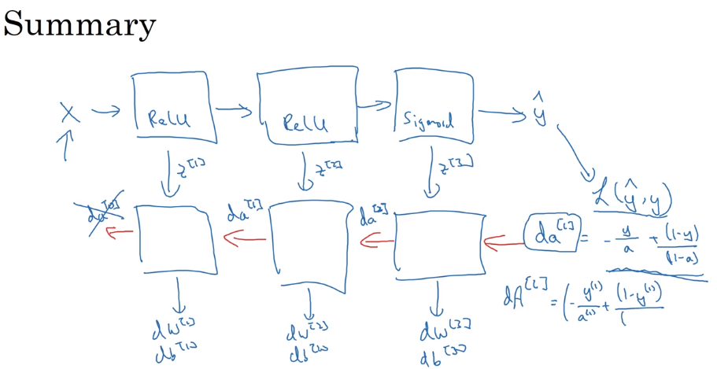

# 43 forward and backwards propagation

- below we will check the forward and backward propagation for layer `l`

## forward propagation

## backward propagation and vectorization

## summary

- this is a short diagram of the steps we follow to create a neural network:

