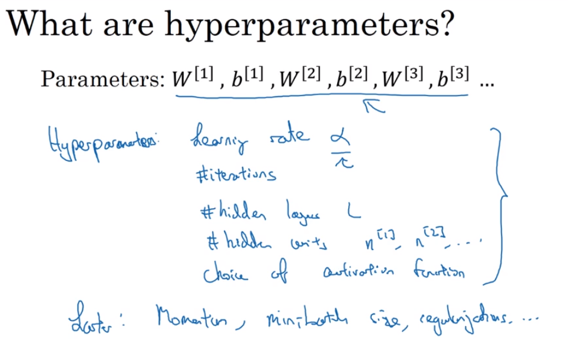
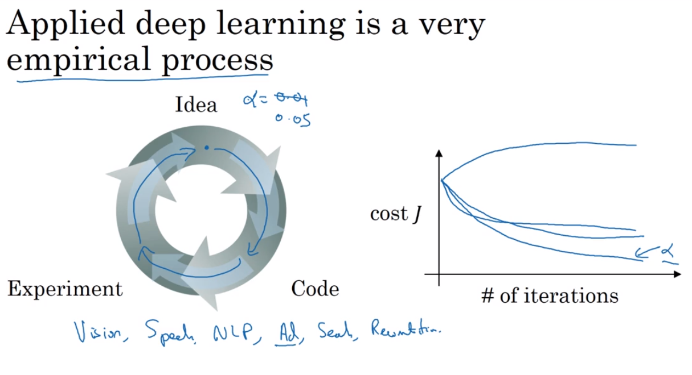

# 44 hyperparameters

- not only we need the weights and the variables and attributes for our examples, but we also need to set the parameters that control the parameters
- hyperparameters: learning rate a, number of iterations, number of hidden layers, number of hidden weights, choice of activation function, momentum rate, mini batch size
  

## applied deep learning is an empirical process nowadays

- you usually start changing your learning rate alpha arbitrarily so that you can check different results in your model

- it is possible that the models we write today won't work as well in the future, because of the changes in computer infrastructure of software algorithm implementation and so on.
